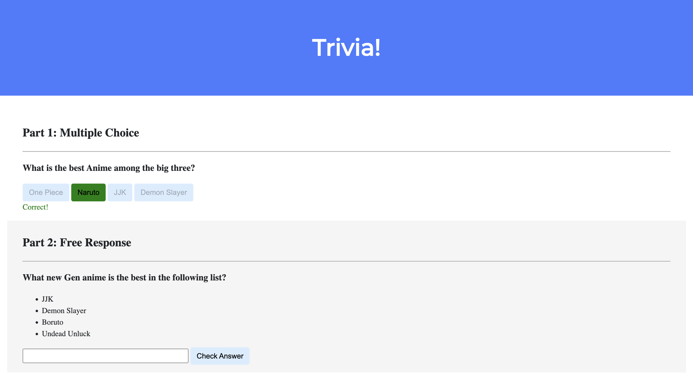

# TriviaQuestions
Anime Trivia: Test your knowledge of popular anime!

# Anime Trivia

Anime Trivia is a fun quiz game that challenges players' knowledge of popular anime series, characters, and storylines. Players are presented with a series of questions related to anime, and they must provide the correct answers. The game provides instant feedback on whether the answer is correct or incorrect and keeps track of the player's score. It's a great way for anime enthusiasts to test their knowledge and discover new trivia about their favorite series.

## Usage

1. Clone the repository to your local machine.
2. Open the `index.html` file in your web browser.
3. Answer the trivia questions and see how many you can get right!
4. Enjoy testing your knowledge of anime!

## Repository

